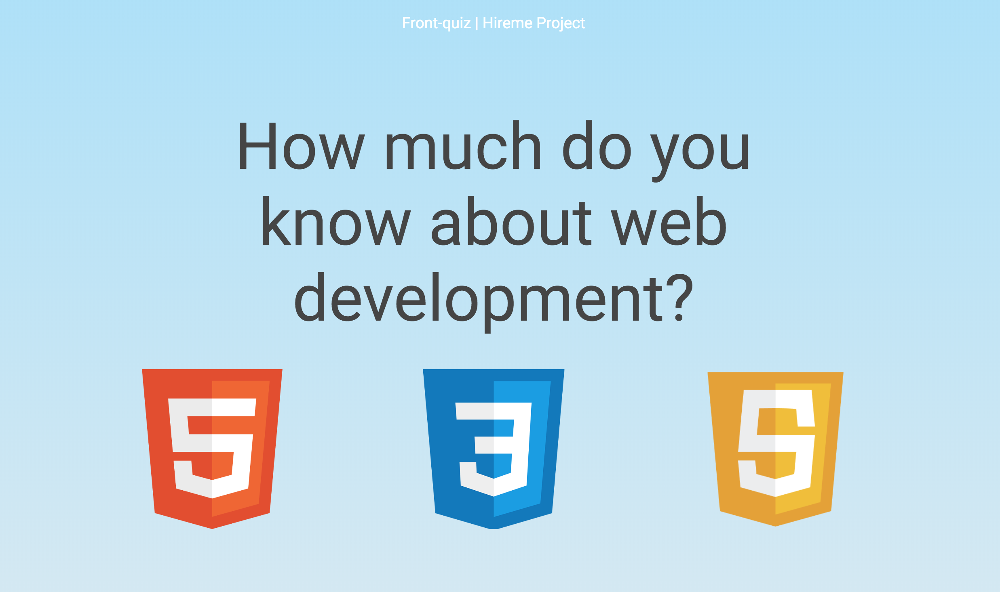

# Project Hireme quiz
 A quiz web app about HTML, CSS, and Javascript
 

### Link to the Project
* [Live Project](http://bit.ly/hireMe_MBY) 

## Tech Stack
* CSS
* Javascript
* Node.js
* pug/ Jade
* SQLite3

## goal
Quiz site will have 3 question sections, for HTML, CSS and Javascrip

First stage will have a hardcode structure. Includes landing page, question page, and result

Then, will use database to make it dynamic

## Project Diffculity

* Setup Node engine rendering pug

* Pulling questions and answers from SQLite3 database

* Generating random questions for every refresh

## introduction
[brykka](https://github.com/brykka) - Continuously looking to imporve and expand my knowledge with interesting new projects.

[miimii](https://github.com/Miimii1010) - 

[yijen](https://github.com/theyij) - Taiwanese Front-End Developer located in Tokyo. Enjoy the process of problem solving and challenging unknown technology.

We met in a meetup in Tokyo
After that, we decided to form a study group together to improve individual skills and collaborate with others.
Currently working on a quiz site to practise front-end technology.

## weekly log
- 11/22 : Final adjustment on the project, calculate points, expend database, responsive css. 

- 11/15 : Project functional in generating random questions and clean up css. 

- 10/24
I - Update landing page layout, link data from main.js to pug file. Feel free to update your personal site & linkedin url. Will work on database before next study session.  

- 10/18 :

I - Make this quiz application work with only HTML, CSS & Javascript today, will make it dynamic in the future

B- started working on the homepage and tried to import css files

- 10/11 : First study group : )) Setup github & git, decide to do a group project together

  
